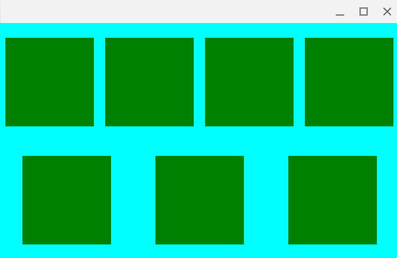

# QML flex layout

Qt quick layout system is real ugly. It would be much more convenient to use flexbox for positioning elements. This repository contains a set of qt quick bindings to the [Yoga](https://github.com/facebook/yoga) layout engine from React Native for rendering flexbox.



```
import QtQuick 2.5
import QtQuick.Window 2.0

Window {
    visible: true
    height: 400
    width: 675
    Rectangle {
        anchors.fill: parent
        color: "cyan"
        Flex {
            height: parent.height
            width: parent.width
            
            flexDirection: "row"
            flexWrap: "wrap"
            justifyContent: "spaceAround"
            alignItems: "center"
            alignSelf: "center"
            alignContent: "stretch"

            Rectangle { color: "green"; height: 150; width: 150 }
            Rectangle { color: "green"; height: 150; width: 150 }
            Rectangle { color: "green"; height: 150; width: 150 }
            Rectangle { color: "green"; height: 150; width: 150 }
            Rectangle { color: "green"; height: 150; width: 150 }
            Rectangle { color: "green"; height: 150; width: 150 }
            Rectangle { color: "green"; height: 150; width: 150 }
        }
    }
}

```
